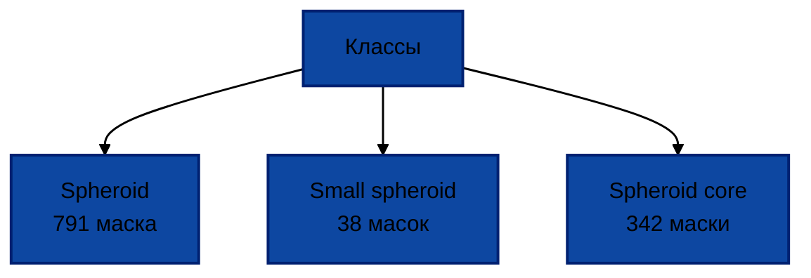

# Spheroids-analysis
Repository contains raw spheroids data in CZI, TIF. Data collected from pictures is in XML format. Also here are ipynb files with discribtion of the way of forming and analyzing raw data.
<style>
body, p, h1, h2, h3, h4, h5, h6, li, td, th, span, div, strong, em {
    color: black !important;
}

/* Специально для кода */
code, pre, .codehilite {
    color: black !important;
}

/* Для ссылок (если нужно) */
a {
    color: black !important;
    text-decoration: underline;
}

/* Черные треугольники-стрелки */
.marker path {
    fill: black !important;
    stroke: black !important;
}

/* Диаграмма - БЕЛЫЙ ТЕКСТ */
.mermaid {
    color: white !important;
}

/* Явно задаем белый цвет для текста внутри узлов диаграммы */
.mermaid .nodeLabel,
.mermaid .edgeLabel,
.mermaid span,
.mermaid p,
.mermaid .label,
.mermaid .node rect + div,
.mermaid .node span,
.mermaid .node p {
    color: white !important;
    fill: white !important;
}

.mermaid .node span {
    color: white !important;
}
</style>
# Информация о датасете 
## Сырые данные
Сырые изображения сфероидов, полученные с микроскопа, имеют формат CZI.<br/> Для дальнейшей работы изображения были переведены в формат TIF  (библиотеки czifile, tiffile).

Сырой набор данных содержал 89 изображений (19 изображений HDF, 70 изображения ARPE-19). 65 изображений были отобраны для аннотации и анализа. Все вошедшие изображения имеют увеличение 4х. Конечный набор данных имеет следующую архитектуру: cell line->date->agent.

21 изображений не содержали в себе данных об агенте, поэтому они не вошли в датасет. Кроме того, в датасет не вошли ещё 3 изображения с увеличением 10х. Таким образом, было проигнорировано 16/19 изображений HDF и 8/70 изображений ARPE-19. Для культуры HDF остались изображения только с одного дня эксперимента (03.07.2025).

>Итого маски были сделаны для 3 изображений HDF и 62 изображений ARPE-19.

## Аннотирование сырых данных
Для аннотирования tif изображения были загружены на платформу CVAT. Создание масок проводилось вручную с помощью цифрового планшета. 

После аннотирования с сайта CVAT был выгружен единый XML-файл. Он содержит маски отдельных сфероидов в следующем формате:
 ```python
 <image id="0" name="ARPE_Y27632_0h.tif" width="1280" height="960">
    <mask label="Spheroid" source="manual" occluded="0" rle="21, 5, 33, 16, 21, 23, 17, 28, 14, 30, 12, 32, 11, 32, 11, 33, 10, 33, 9, 35, 8, 36, 6, 38, 5, 39, 3, 40, 3, 40, 3, 40, 3, 40, 2, 41, 2, 41, 2, 42, 1, 127, 1, 42, 1, 41, 3, 40, 3, 40, 4, 39, 5, 37, 7, 36, 7, 36, 7, 35, 9, 33, 11, 31, 13, 27, 16, 26, 18, 16, 1, 6, 21, 14, 34, 8, 38, 3, 23" left="1146" top="42" width="43" height="40" z_order="0">
    </mask>
 <mask> и так далее несколько масок для изображения "ARPE_Y27632_0h" ... </mask>
<image ... и так далее следующие изображения с масками внутри... 
```
Далее файл XML со всеми масками был разбит по отдельным маскам. Маски к одной картинке находятся в одной папке с оригинальным названием картинки. 

В результате работы был сформирован набор данных состоящий из 65 аннотированных изображений (в формате XML). Были аннотированы три класса: Spheroid, Small spheroid, Spheroid core
## Группировка файлов
Spheroids_masks<br/>
├───ARPE-19<br/>
│   ├───20250702<br/>
│   │   ├───blebb <br/>
│   │   │   ├─ARPE_blebb_0h <br/>
│   │   │   │   ├──mask_001_Spheroid <br/>
│   │   │   │   ├──mask_002_Spheroid <br/>
│   │   │   │   ├──mask_003_Spheroid <br/>
│   │   │   │   └── ...<br/>
│   │   │   │<br/>
│   │   │   ├─ARPE_blebb_3h <br/>
│   │   │   │   └─ и тд. маски<br/>
│   │   │   └─ и тд. папки с названиями изображений и масками внутри папок <br/>
│   │   │ <br/>
│   │   ├───control (4 подпапки, 64 файла)<br/>
│   │   ├───cyt (6 подпапок, 66 файлов)<br/>
│   │   └───y27632 (6 подпапок, 86 файлов)<br/>
│   │<br/>
│   ├───20250703<br/>
│   │   ├───blebb (3 подпапки, 35 файлов)<br/>
│   │   ├───control (5 подпапок, 44 файла)<br/>
│   │   ├───cyt (6 подпапок, 71 файл)<br/>
│   │   └───y27632 (6 подпапок, 49 файлов)<br/>
│   │<br/>
│   ├───20250704<br/>
│   │   ├───blebb (3 подпапки, 83 файла)<br/>
│   │   ├───control (7 подпапок, 72 файла)<br/>
│   │   ├───cyt (6 подпапок, 41 файл)<br/>
│   │   └───y27632 (6 подпапок, 29 файлов)<br/>
│   │<br/>
│   ├───20250711<br/>
│   │   ├───blebb (3 подпапки, 34 файла)<br/>
│   │   ├───control (6 подпапок, 36 файлов)<br/>
│   │   ├───cyt (6 подпапок, 68 файлов)<br/>
│   │   └───y27632 (6 подпапок, 38 файлов)<br/>
│   │<br/>
│   └───20250714<br/>
│   │   ├──blebb (3 подпапки, 49 файлов)<br/>
│   │   ├───control (6 подпапок, 63 файла)<br/>
│   │   ├──cyt (3 подпапки, 43 файла)<br/>
│   │   └───y27632 (6 подпапок, 29 файлов)<br/>
│<br/>
└───HDF<br/>
&ensp;&ensp;└───20250703<br/>
&ensp;&ensp;&ensp;&ensp;&ensp; └───control (6 подпапок, 30 файлов)<br/>
## Подробнее про маски
### Классы

**"Spheroid"**: включает в себя и сам шар сфероида, и его клеточное окружение (появляется на изображениях, начиная с третьего дня эксперимента (04.07.2025)).

**"Small spheroid"**: маленький сфероид значительно отличается по размерам от обычного, поэтому был выделен в отдельный лейбл.

**"Spheroid core"**: на сфероидах, где есть клеточное окружение, была выделена отдельно наиболее плотная область, соответствующая изначальному сфероиду. 

### Распределение классов по культурам, датам и агентам


#### Итоговые суммы
| Культура | Дата       | Агент | Spheroid| Small spheroid | Spheroid core|
|----------|------------|------|---------|----------------|--------------|
| **ARPE-19** | 2025/07/02 | **Control** | 60 | 4 | 0            |
| |            | **Blebbistatin** | 30 | 3 | 0            |
| |            | **Cytochalasin** | 64 | 2 | 0            |
| |            | **Y27632** | 60 | 22 | 0            |
| | 2025/07/03 | **Control** | 46 | 2 | 0            |
| |            | **Blebbistatin** | 34 | 1 | 0            |
| |            | **Cytochalasin** | 58 | 4 | 0            |
| |            | **Y27632** | 50 | 0 | 0            |
| | 2025/07/04 | **Control** | 68 | 0 | 38           |
| |            | **Blebbistatin** | 42 | 0 | 44           |
| |            | **Cytochalasin** | 54 | 0 | 18           |
| |            | **Y27632** | 20 | 0 | 16           |
| | 2025/07/11 | **Control** | 22 | 0 | 22           |
| |            | **Blebbistatin** | 16 | 0 | 18           |
| |            | **Cytochalasin** | 36 | 0 | 40           |
| |            | **Y27632** | 26 | 0 | 26           |
| | 2025/07/14 | **Control** | 28 | 0 | 30           |
| |            | **Blebbistatin** | 19 | 0 | 23           |
| |            | **Cytochalasin** | 18 | 0 | 21           |
| |            | **Y27632** | 18 | 0 | 28           |
| **HDF** | 2025/07/03 | **Control** | 18 | 0 | 18           |

#### Суммы по агентам

| Культура | Агент | Spheroid | Small spheroid | Spheroid core |
|----------|-------|----------|----------------|---------------|
| **ARPE-19** | Control | 224 | 6 | 90 | 
| | Blebbistatin | 141 | 4 | 85 | 
| | Cytochalasin | 230 | 6 | 79 | 
| | Y27632 | 174 | 22 | 70 | 
| **HDF** | Control | 18 | 0 | 18 |

#### Суммы по культурам
| Культура | Spheroid | Small spheroid | Spheroid core |
|----------|----------|----------------------|---------------------|
| **ARPE-19** | **769**   | **38**               | **324**             |
| **HDF** | **18**   | **0**                | **18**              |


#### ARPE-19: Суммы по датам

| Дата | Spheroid | Small spheroid | Spheroid core | Всего объектов |
|------|----------|----------------|---------------|----------------|
| **2025/07/02** | 214 | 31 | 0 | **245** |
| **2025/07/03** | 188 | 7 | 0 | **195** |
| **2025/07/04** | 184 | 0 | 116 | **300** |
| **2025/07/11** | 100 | 0 | 106 | **206** |
| **2025/07/14** | 83 | 0 | 102 | **185** |
| **Всего ARPE-19** | **769** | **38** | **324** | **1131** |

#### HDF: Суммы по датам

| Дата | Агент | Spheroid | Small spheroid | Spheroid core | Всего |
|------|-------|----------|----------------|---------------|-------|
| **2025/07/03** | Control | 18 | 0 | 18 | **36** |


### RLE строка.
**RLE (Run-Length Encoding)** – это способ компактного представления бинарной маски. Кодируется маска следующим образом: 

1) изображение обрезается до прямоугольника с маской внутри (bounding box)
2) в bbox выделяется фон (0) и маска (1). Далее картинка попиксельно (по строкам, сверху вниз) кодируется в виде строки из нулей и единиц. Количество одинаковых непрерывающихся элементов складываются. Именно их количество и вписывается в RLE. 
Пример:<br/> 
| 0 | 1 | 0 | 0 | <br/> 
| 1 | 1 | 0 | 1 | <br/> 
| 0 | 1 | 1 | 0 | <br/> 
Строка изображения = 010011010110 <br/> 
**RLE** = “1, 1, 2, 2, 1, 1, 1, 2,1”

В конце маски написано положение на общей картинке bbox (left="1146" top="42" width="43" height="40" z_order="0")

### Декодирование маски в Python
Декодирование масок было реализовано с помощью оригинальной функции, написанной на языке программирования Python (библиотека _numpy_):
```python
def decode_cvat_rle(rle_str: str, h: int, w: int, occluded: str) -> np.ndarray:
    counts = [int(x.strip()) for x in rle_str.split(",") if x.strip() != ""] #переводим rle строку в лист, состоящий из целых чисел (количеств непрерывных элементов)
    flat = np.zeros(h * w, dtype=np.uint8) # создаем пустую строку длиной ширина*длина прямоугольника bounding box
    idx = 0 # номер элемента в строке
    if occluded == "0": 
        val = 0  # маска начинается с 0
    else: val = 1 # маска начинается с 1
    for c in counts:
        if idx + c > flat.size:
            raise ValueError(f"RLE overruns bbox size: idx={idx}, c={c}, size={flat.size}") 
        if val == 1:
            flat[idx:idx + c] = 1
        idx += c
        val = 1 - val
    return flat.reshape((h, w))
```

## Свойства, извлекаемые из масок
### Описание свойств
_Примечание:_ во всех свойствах учтён масштаб изображений (2.2 мкм/пиксель), что соответствует увеличению 4х на микроскопе.

| Параметр                      | Описание                                                                                 |
|-------------------------------|------------------------------------------------------------------------------------------|
| **Area**                      | Площадь объекта - количество пикселей внутри контура объекта                             |
| **Perimeter**                 | Периметр объекта - длина границы объекта в пикселях                                      |
| **Aspect_ratio**              | Соотношение сторон - отношение ширины к высоте ограничивающего прямоугольника            |
| **Extent**                    | Прямоугольность - отношение площади объекта к площади его ограничивающего прямоугольника |
| **Equivalent_diameter**       | Эквивалентный диаметр - диаметр круга, имеющего ту же площадь, что и объект              |
| **Major_axis_length**         | Длина большой оси - длина большой оси эллипса, имеющего те же моменты, что и объект      |
| **Minor_axis_length**         | Длина малой оси - длина малой оси эллипса, имеющего те же моменты, что и объект          |
| **Orientation_degrees**       | Ориентация - угол _(в градусах)_ между большой осью объекта и горизонтальной осью        |
| **Eccentricity**              | Эксцентриситет - мера вытянутости объекта (0 для круга, 1 для линии)                     |
| **Circularity**               | Круглость - насколько объект близок к идеальному кругу (4π×площадь/периметр²)            |
| **Solidity**                  | Сплошность - отношение площади объекта к площади его выпуклой оболочки                   |
| **Convexity**                 | Выпуклость - отношение периметра выпуклой оболочки к периметру объекта                   |
| **Roundness**                 | Округлость - 4 × площадь / (π × (длина большой оси)²)                                    |
| **Compactness**               | Компактность - периметр² / (4π × площадь)                                                |
| **Feret_max**                 | Максимальный диаметр Фере - максимальное расстояние между параллельными касательными     |
| **Feret_min**                 | Минимальный диаметр Фере - минимальное расстояние между параллельными касательными       |
| **Num_vertices**              | Количество вершин - число вершин в полигональной аппроксимации контура                   |
| **Logarithmic_hu_moment_1-7** | Логарифмические моменты Ху от 1 до 7 - инвариантные момент (логарифмическая форма)       |

